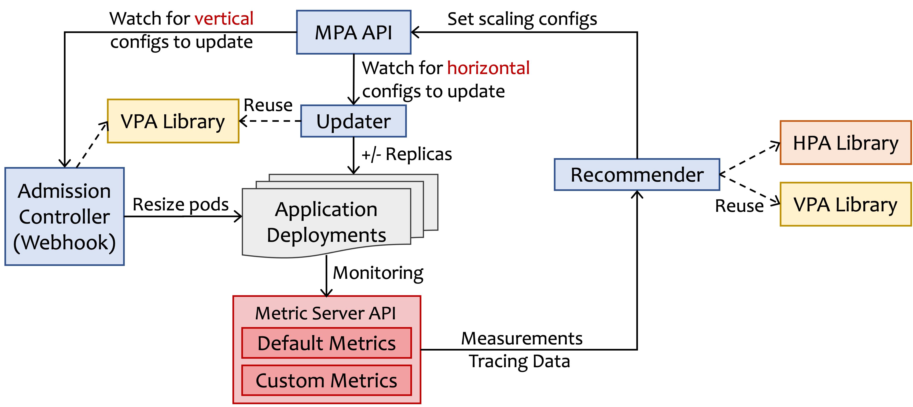

# KEP-NNNN: Multi-dimensional Pod Autoscaler

<!-- toc -->
- [Release Signoff Checklist](#release-signoff-checklist)
- [Summary](#summary)
- [Motivation](#motivation)
  - [Goals](#goals)
  - [Non-Goals](#non-goals)
- [Proposal](#proposal)
  - [User Stories (Optional)](#user-stories-optional)
    - [Story 1](#story-1)
    - [Story 2](#story-2)
  - [Notes/Constraints/Caveats (Optional)](#notesconstraintscaveats-optional)
  - [Risks and Mitigations](#risks-and-mitigations)
- [Design Details](#design-details)
  - [Test Plan](#test-plan)
      - [Prerequisite testing updates](#prerequisite-testing-updates)
      - [Unit tests](#unit-tests)
      - [Integration tests](#integration-tests)
      - [e2e tests](#e2e-tests)
  - [Graduation Criteria](#graduation-criteria)
  - [Upgrade / Downgrade Strategy](#upgrade--downgrade-strategy)
  - [Version Skew Strategy](#version-skew-strategy)
- [Production Readiness Review Questionnaire](#production-readiness-review-questionnaire)
  - [Feature Enablement and Rollback](#feature-enablement-and-rollback)
  - [Rollout, Upgrade and Rollback Planning](#rollout-upgrade-and-rollback-planning)
  - [Monitoring Requirements](#monitoring-requirements)
  - [Dependencies](#dependencies)
  - [Scalability](#scalability)
  - [Troubleshooting](#troubleshooting)
- [Implementation History](#implementation-history)
- [Drawbacks](#drawbacks)
- [Alternatives](#alternatives)
- [Infrastructure Needed (Optional)](#infrastructure-needed-optional)
<!-- /toc -->

## Release Signoff Checklist

Items marked with (R) are required *prior to targeting to a milestone / release*.

- [ ] (R) Enhancement issue in release milestone, which links to KEP dir in [kubernetes/enhancements] (not the initial KEP PR)
- [ ] (R) KEP approvers have approved the KEP status as `implementable`
- [ ] (R) Design details are appropriately documented
- [ ] (R) Test plan is in place, giving consideration to SIG Architecture and SIG Testing input (including test refactors)
  - [ ] e2e Tests for all Beta API Operations (endpoints)
  - [ ] (R) Ensure GA e2e tests meet requirements for [Conformance Tests](https://github.com/kubernetes/community/blob/master/contributors/devel/sig-architecture/conformance-tests.md) 
  - [ ] (R) Minimum Two Week Window for GA e2e tests to prove flake free
- [ ] (R) Graduation criteria is in place
  - [ ] (R) [all GA Endpoints](https://github.com/kubernetes/community/pull/1806) must be hit by [Conformance Tests](https://github.com/kubernetes/community/blob/master/contributors/devel/sig-architecture/conformance-tests.md) 
- [ ] (R) Production readiness review completed
- [ ] (R) Production readiness review approved
- [ ] "Implementation History" section is up-to-date for milestone
- [ ] User-facing documentation has been created in [kubernetes/website], for publication to [kubernetes.io]
- [ ] Supporting documentation—e.g., additional design documents, links to mailing list discussions/SIG meetings, relevant PRs/issues, release notes

<!--
**Note:** This checklist is iterative and should be reviewed and updated every time this enhancement is being considered for a milestone.
-->

[kubernetes.io]: https://kubernetes.io/
[kubernetes/enhancements]: https://git.k8s.io/enhancements
[kubernetes/kubernetes]: https://git.k8s.io/kubernetes
[kubernetes/website]: https://git.k8s.io/website

## Summary

Currently, Horizontal Pod Autoscaler (HPA) and Vertical Pod Autoscaler (VPA) control the scaling actions separately as independent controllers to determine the resource allocation for a containerized application.
Due to the independence of these two controllers, when they are configured to optimize the same target, e.g., CPU usage, they can lead to an awkward situation where HPA tries to spin more pods based on the higher-than-threshold CPU usage while VPA tries to squeeze the size of each pod based on the lower CPU usage (after scaling out by HPA).
The final outcome would be a large number of small pods created for the workloads.
Manual fine-tuning the timing to do vertical/horizontal scaling and prioritization are usually needed for syncronization of the HPA and VPA.

We propose a Multi-dimensional Pod Autoscaling (MPA) framework that combines the actions of vertical and horizontal autoscaling in a single action but separates the actuation completely from the controlling algorithms.
It consists of three controllers (i.e., a recommender, an updater, and an admission controller) and an MPA API (i.e., a CRD object or CR) that connects the autoscaling recommendations to actuation.
The multidimensional scaling algorithm is implemented in the recommender.
The scaling decisions derived from the recommender are stored in the MPA object.
The updater and the admission controller retrieve those decisions from the MPA object and actuate those vertical and horizontal actions.
Our proposed MPA (with the separation of recommendations from actuation) allows developers to replace the default recommender with their alternative customized recommender, so developers can provide their own recommender implementing advanced algorithms that control both scaling actions across different resource dimensions.

## Motivation

To scale application Deployments, Kubernetes supports both horizontal and vertical scaling with a Horizontal Pod Autoscaler (HPA) and a Vertical Pod Autoscaler (VPA), respectively.
Currently, [HPA] and [VPA] work separately as independent controllers to determine the resource allocation of a containerized application.
- HPA determines the number of replicas for each Deployment of an application with the aim of automatically scaling the workload to match demand. The HPA controller, running within the Kubernetes control plane, periodically adjusts the desired scale of its target (e.g., a Deployment) to match observed metrics such as average CPU utilization, average memory utilization, or any other custom metric the users specify (e.g., the rate of client requests per second or I/O writes per second). The autoscaling algorithm that the HPA controller uses is based on the equation `desired_replicas = current_replicas * (current_metric_value / desired_metric_value)`.
- VPA determines the size of containers, namely CPU and Memory Request and Limit. The primary goal of VPA is to reduce maintenance costs and improve the utilization of cluster resources. When configured, it will set the Request and Limit automatically based on historical usage and thus allow proper scheduling onto nodes so that the appropriate resource amount is available for each replica. It will also maintain ratios between limits and requests that were specified in the initial container configuration.

When using HPA and VPA together to both reduce resource usage and guarantee application performance, VPA resizes pods based on their measured resource usage, and HPA scales in/out based on the customer application performance metric, and their logic is entirely ignorant of each other.
Due to the independence of these two controllers, they can lead to an awkward situation where VPA tries to squeeze the pods into smaller sizes based on their measured utilization.
Still, HPA tries to scale out the applications to improve the customized performance metrics.
It is also [not recommended] to use HPA together with VPA for CPU or memory metrics.
Therefore, there is a need to combine the two controllers so that horizontal and vertical scaling decisions are made in combination for an application to achieve both objectives, including resource efficiency and the application service-level agreements (SLA)/performance goals.
However, existing VPA/HPA designs cannot accommodate such requirements.
Manual fine-tuning the timing or frequency to do vertical/horizontal scaling and prioritization are usually needed for syncronization of the HPA and VPA.

[HPA](https://kubernetes.io/docs/tasks/run-application/horizontal-pod-autoscale/)
[VPA](https://github.com/kubernetes/autoscaler/tree/master/vertical-pod-autoscaler)
[not recommended](https://cloud.google.com/kubernetes-engine/docs/concepts/horizontalpodautoscaler)

### Goals

- Design and implement a holistic framework with a set of controllers to achieve multi-dimensional pod autoscaling (MPA).
- Separate the decision actuation from recommendations for both horizontal and vertical autoscaling.
- Re-use existing HPA and VPA libraries as much as possible in MPA.

### Non-Goals

- Design of new multi-dimensional pod autoscaling algorithms.
- Rewrite functionalities that have been implemented with existing HPA and VPA.

## Proposal
### User Stories
#### A New MPA Framework with Reinforcement Learning

Many studies in research show that combined horizontal and vertical scaling can guarantee application performance with better resource efficiency using advanced algorithms such as reinforcement learning [1, 2]. These algorithms cannot be used with existing HPA and VPA frameworks. A new framework (MPA) is needed to combine horizontal and vertical scaling actions and separate the actuation of scaling actions from the autoscaling algorithms. The new MPA framework will work for all workloads on Kubernetes.

[1] Haoran Qiu, Subho S. Banerjee, Saurabh Jha, Zbigniew T. Kalbarczyk, Ravishankar K. Iyer (2020). FIRM: An Intelligent Fine-Grained Resource Management Framework for SLO-Oriented Microservices. In Proceedings of the 14th USENIX Symposium on Operating Systems Design and Implementation (OSDI 2020).
[2] Haoran Qiu, Weichao Mao, Archit Patke, Chen Wang, Hubertus Franke, Zbigniew T. Kalbarczyk, Tamer Başar, Ravishankar K. Iyer (2022). SIMPPO: A Scalable and Incremental Online Learning Framework for Serverless Resource Management. In Proceedings of the 13th ACM Symposium on Cloud Computing (SoCC 2022).

#### Different Scaling Actions for Different Types of Resources

For certain workloads, to ensure a custom metric (e.g., throughput or request-serving latency), horizontal scaling typically controls the CPU resources effectively, and vertical scaling is typically effective in increasing or decreasing the allocated memory capacity per pod. Thus, there is a need to control different types of resources at the same time using different scaling actions. Existing VPA and HPA can control these separately. However, they cannot achieve the same objective, e.g., guarantee a custom metric within an SLA target, by controlling both dimensions with different resource types independently. For example, they can lead to an awkward situation where HPA tries to spin more pods based on the higher-than-threshold CPU usage while VPA tries to squeeze the size of each pod based on the lower memory usage (after scaling out by HPA). In the end, there will be a large number of small pods created for the workloads.

## Design Details

Our proposed MPA framework consists of three controllers (i.e., a recommender, an updater, and an admission controller) and an MPA API (i.e., a CRD object or CR) that connects the autoscaling recommendations to actuation. The figure below describes the architectural overview of the proposed MPA framework.

**MPA API.** Application owners specify the autoscaling configurations which include (1) whether they only want to know the recommendations from MPA or they want MPA to directly actuate the autoscaling decisions; (2) application SLAs (e.g., in terms of latency or throughput); (3) any custom metrics if there are; and (4) other autoscaling configurations that exist in HPA and VPA (e.g., desired resource utilizations, container update policies, min and max number of replicas). MPA API is also responsible for connecting the autoscaling actions generated from the MPA Recommender to MPA Admission Controller and Updater which actually execute the scaling actions. MPA API is created based on the [multidimensional Pod scaling service] (not open-sourced) provided by Google. MPA API is a Custom Resource Definition (CRD) in Kubernetes and each MPA instance is a CR. MPA CR keeps track of recommendations on target requests and target replica numbers.

[multidimensional Pod scaling service](https://cloud.google.com/kubernetes-engine/docs/how-to/multidimensional-pod-autoscaling)

**Metric Server API.** The Metric Server API serves both default metrics or custom metrics associated with any Kubernetes objects. Custom metrics could be the application latency, throughput, or any other application-specific metrics. HPA already consumes metrics from such [a variety of metric APIs] (e.g., `metrics.k8s.io` API for resource metrics provided by metrics-server, `custom.metrics.k8s.io` API for custom metrics provided by "adapter" API servers provided by metrics solution vendors, and the `external.metrics.k8s.io` API for external metrics provided by the custom metrics adapters as well. A popular choice for the metrics collector is Prometheus. The metrics are then used by the MPA Recommender for making autoscaling decisions.

[a variety of metric APIs](https://kubernetes.io/docs/tasks/run-application/horizontal-pod-autoscale/#support-for-metrics-apis)

**MPA Recommender.** MPA Recommender retrieves the time-indexed measurement data from the Metrics APIs and generates the vertical and horizontal scaling actions. The actions from the MPA Recommender are then updated in the MPA API object. The autoscaling behavior is based on user-defined configurations. Users can implement their own recommenders as well.

**MPA Updater.** MPA Updater will update the number of replicas in the deployment and evict the eligible pods for vertical scaling.

**MPA Admission-Controller.** If users intend to directly execute the autoscaling recommendations generated from the MPA Recommender, the MPA Admission-Controller will update the deployment configuration (i.e., the size of each replica) and configure the rolling update to the Application Deployment.

### Test Plan

<!--
**Note:** *Not required until targeted at a release.*
The goal is to ensure that we don't accept enhancements with inadequate testing.

All code is expected to have adequate tests (eventually with coverage
expectations). Please adhere to the [Kubernetes testing guidelines][testing-guidelines]
when drafting this test plan.

[testing-guidelines]: https://git.k8s.io/community/contributors/devel/sig-testing/testing.md
-->

[ ] I/we understand the owners of the involved components may require updates to
existing tests to make this code solid enough prior to committing the changes necessary
to implement this enhancement.

#### Unit Tests

<!--
In principle every added code should have complete unit test coverage, so providing
the exact set of tests will not bring additional value.
However, if complete unit test coverage is not possible, explain the reason of it
together with explanation why this is acceptable.
-->

<!--
Additionally, for Alpha try to enumerate the core package you will be touching
to implement this enhancement and provide the current unit coverage for those
in the form of:
- <package>: <date> - <current test coverage>
The data can be easily read from:
https://testgrid.k8s.io/sig-testing-canaries#ci-kubernetes-coverage-unit

This can inform certain test coverage improvements that we want to do before
extending the production code to implement this enhancement.
-->

<!-- - `<package>`: `<date>` - `<test coverage>` -->

#### Integration Tests

<!--
This question should be filled when targeting a release.
For Alpha, describe what tests will be added to ensure proper quality of the enhancement.

For Beta and GA, add links to added tests together with links to k8s-triage for those tests:
https://storage.googleapis.com/k8s-triage/index.html
-->

<!-- - <test>: <link to test coverage> -->

#### End-to-End Tests

<!--
This question should be filled when targeting a release.
For Alpha, describe what tests will be added to ensure proper quality of the enhancement.

For Beta and GA, add links to added tests together with links to k8s-triage for those tests:
https://storage.googleapis.com/k8s-triage/index.html

We expect no non-infra related flakes in the last month as a GA graduation criteria.
-->

<!-- - <test>: <link to test coverage> -->

### Graduation Criteria

<!--
**Note:** *Not required until targeted at a release.*

Define graduation milestones.

These may be defined in terms of API maturity, [feature gate] graduations, or as
something else. The KEP should keep this high-level with a focus on what
signals will be looked at to determine graduation.

Consider the following in developing the graduation criteria for this enhancement:
- [Maturity levels (`alpha`, `beta`, `stable`)][maturity-levels]
- [Feature gate][feature gate] lifecycle
- [Deprecation policy][deprecation-policy]

Clearly define what graduation means by either linking to the [API doc
definition](https://kubernetes.io/docs/concepts/overview/kubernetes-api/#api-versioning)
or by redefining what graduation means.

In general we try to use the same stages (alpha, beta, GA), regardless of how the
functionality is accessed.

[feature gate]: https://git.k8s.io/community/contributors/devel/sig-architecture/feature-gates.md
[maturity-levels]: https://git.k8s.io/community/contributors/devel/sig-architecture/api_changes.md#alpha-beta-and-stable-versions
[deprecation-policy]: https://kubernetes.io/docs/reference/using-api/deprecation-policy/

Below are some examples to consider, in addition to the aforementioned [maturity levels][maturity-levels].

#### Alpha

- Feature implemented behind a feature flag
- Initial e2e tests completed and enabled

#### Beta

- Gather feedback from developers and surveys
- Complete features A, B, C
- Additional tests are in Testgrid and linked in KEP

#### GA

- N examples of real-world usage
- N installs
- More rigorous forms of testing—e.g., downgrade tests and scalability tests
- Allowing time for feedback

**Note:** Generally we also wait at least two releases between beta and
GA/stable, because there's no opportunity for user feedback, or even bug reports,
in back-to-back releases.

**For non-optional features moving to GA, the graduation criteria must include
[conformance tests].**

[conformance tests]: https://git.k8s.io/community/contributors/devel/sig-architecture/conformance-tests.md

#### Deprecation

- Announce deprecation and support policy of the existing flag
- Two versions passed since introducing the functionality that deprecates the flag (to address version skew)
- Address feedback on usage/changed behavior, provided on GitHub issues
- Deprecate the flag
-->

## Production Readiness Review Questionnaire

<!--
Production readiness reviews are intended to ensure that features merging into
Kubernetes are observable, scalable and supportable; can be safely operated in
production environments, and can be disabled or rolled back in the event they
cause increased failures in production. See more in the PRR KEP at
https://git.k8s.io/enhancements/keps/sig-architecture/1194-prod-readiness.

The production readiness review questionnaire must be completed and approved
for the KEP to move to `implementable` status and be included in the release.

In some cases, the questions below should also have answers in `kep.yaml`. This
is to enable automation to verify the presence of the review, and to reduce review
burden and latency.

The KEP must have a approver from the
[`prod-readiness-approvers`](http://git.k8s.io/enhancements/OWNERS_ALIASES)
team. Please reach out on the
[#prod-readiness](https://kubernetes.slack.com/archives/CPNHUMN74) channel if
you need any help or guidance.
-->

### Feature Enablement and Rollback

<!--
This section must be completed when targeting alpha to a release.
-->

#### How can this feature be enabled / disabled in a live cluster?

<!--
Pick one of these and delete the rest.

Documentation is available on [feature gate lifecycle] and expectations, as
well as the [existing list] of feature gates.

[feature gate lifecycle]: https://git.k8s.io/community/contributors/devel/sig-architecture/feature-gates.md
[existing list]: https://kubernetes.io/docs/reference/command-line-tools-reference/feature-gates/
-->

- [ ] Feature gate (also fill in values in `kep.yaml`)
  - Feature gate name:
  - Components depending on the feature gate:
- [ ] Other
  - Describe the mechanism:
  - Will enabling / disabling the feature require downtime of the control
    plane?
  - Will enabling / disabling the feature require downtime or reprovisioning
    of a node? (Do not assume `Dynamic Kubelet Config` feature is enabled).

#### Does enabling the feature change any default behavior?

<!--
Any change of default behavior may be surprising to users or break existing
automations, so be extremely careful here.
-->

#### Can the feature be disabled once it has been enabled (i.e. can we roll back the enablement)?

<!--
Describe the consequences on existing workloads (e.g., if this is a runtime
feature, can it break the existing applications?).

Feature gates are typically disabled by setting the flag to `false` and
restarting the component. No other changes should be necessary to disable the
feature.

NOTE: Also set `disable-supported` to `true` or `false` in `kep.yaml`.
-->

#### What happens if we reenable the feature if it was previously rolled back?

#### Are there any tests for feature enablement/disablement?

<!--
The e2e framework does not currently support enabling or disabling feature
gates. However, unit tests in each component dealing with managing data, created
with and without the feature, are necessary. At the very least, think about
conversion tests if API types are being modified.

Additionally, for features that are introducing a new API field, unit tests that
are exercising the `switch` of feature gate itself (what happens if I disable a
feature gate after having objects written with the new field) are also critical.
You can take a look at one potential example of such test in:
https://github.com/kubernetes/kubernetes/pull/97058/files#diff-7826f7adbc1996a05ab52e3f5f02429e94b68ce6bce0dc534d1be636154fded3R246-R282
-->

### Rollout, Upgrade and Rollback Planning

<!--
This section must be completed when targeting beta to a release.
-->

#### How can a rollout or rollback fail? Can it impact already running workloads?

<!--
Try to be as paranoid as possible - e.g., what if some components will restart
mid-rollout?

Be sure to consider highly-available clusters, where, for example,
feature flags will be enabled on some API servers and not others during the
rollout. Similarly, consider large clusters and how enablement/disablement
will rollout across nodes.
-->

#### What specific metrics should inform a rollback?

<!--
What signals should users be paying attention to when the feature is young
that might indicate a serious problem?
-->

#### Were upgrade and rollback tested? Was the upgrade->downgrade->upgrade path tested?

<!--
Describe manual testing that was done and the outcomes.
Longer term, we may want to require automated upgrade/rollback tests, but we
are missing a bunch of machinery and tooling and can't do that now.
-->

#### Is the rollout accompanied by any deprecations and/or removals of features, APIs, fields of API types, flags, etc.?

<!--
Even if applying deprecation policies, they may still surprise some users.
-->

### Monitoring Requirements

<!--
This section must be completed when targeting beta to a release.

For GA, this section is required: approvers should be able to confirm the
previous answers based on experience in the field.
-->

#### How can an operator determine if the feature is in use by workloads?

<!--
Ideally, this should be a metric. Operations against the Kubernetes API (e.g.,
checking if there are objects with field X set) may be a last resort. Avoid
logs or events for this purpose.
-->

#### How can someone using this feature know that it is working for their instance?

<!--
For instance, if this is a pod-related feature, it should be possible to determine if the feature is functioning properly
for each individual pod.
Pick one more of these and delete the rest.
Please describe all items visible to end users below with sufficient detail so that they can verify correct enablement
and operation of this feature.
Recall that end users cannot usually observe component logs or access metrics.
-->

- [ ] Events
  - Event Reason: 
- [ ] API .status
  - Condition name: 
  - Other field: 
- [ ] Other (treat as last resort)
  - Details:

#### What are the reasonable SLOs (Service Level Objectives) for the enhancement?

<!--
This is your opportunity to define what "normal" quality of service looks like
for a feature.

It's impossible to provide comprehensive guidance, but at the very
high level (needs more precise definitions) those may be things like:
  - per-day percentage of API calls finishing with 5XX errors <= 1%
  - 99% percentile over day of absolute value from (job creation time minus expected
    job creation time) for cron job <= 10%
  - 99.9% of /health requests per day finish with 200 code

These goals will help you determine what you need to measure (SLIs) in the next
question.
-->

#### What are the SLIs (Service Level Indicators) an operator can use to determine the health of the service?

<!--
Pick one more of these and delete the rest.
-->

- [ ] Metrics
  - Metric name:
  - [Optional] Aggregation method:
  - Components exposing the metric:
- [ ] Other (treat as last resort)
  - Details:

#### Are there any missing metrics that would be useful to have to improve observability of this feature?

<!--
Describe the metrics themselves and the reasons why they weren't added (e.g., cost,
implementation difficulties, etc.).
-->

### Dependencies

<!--
This section must be completed when targeting beta to a release.
-->

#### Does this feature depend on any specific services running in the cluster?

<!--
Think about both cluster-level services (e.g. metrics-server) as well
as node-level agents (e.g. specific version of CRI). Focus on external or
optional services that are needed. For example, if this feature depends on
a cloud provider API, or upon an external software-defined storage or network
control plane.

For each of these, fill in the following—thinking about running existing user workloads
and creating new ones, as well as about cluster-level services (e.g. DNS):
  - [Dependency name]
    - Usage description:
      - Impact of its outage on the feature:
      - Impact of its degraded performance or high-error rates on the feature:
-->

### Scalability

<!--
For alpha, this section is encouraged: reviewers should consider these questions
and attempt to answer them.

For beta, this section is required: reviewers must answer these questions.

For GA, this section is required: approvers should be able to confirm the
previous answers based on experience in the field.
-->

#### Will enabling / using this feature result in any new API calls?

<!--
Describe them, providing:
  - API call type (e.g. PATCH pods)
  - estimated throughput
  - originating component(s) (e.g. Kubelet, Feature-X-controller)
Focusing mostly on:
  - components listing and/or watching resources they didn't before
  - API calls that may be triggered by changes of some Kubernetes resources
    (e.g. update of object X triggers new updates of object Y)
  - periodic API calls to reconcile state (e.g. periodic fetching state,
    heartbeats, leader election, etc.)
-->

#### Will enabling / using this feature result in introducing new API types?

<!--
Describe them, providing:
  - API type
  - Supported number of objects per cluster
  - Supported number of objects per namespace (for namespace-scoped objects)
-->

#### Will enabling / using this feature result in any new calls to the cloud provider?

<!--
Describe them, providing:
  - Which API(s):
  - Estimated increase:
-->

#### Will enabling / using this feature result in increasing size or count of the existing API objects?

<!--
Describe them, providing:
  - API type(s):
  - Estimated increase in size: (e.g., new annotation of size 32B)
  - Estimated amount of new objects: (e.g., new Object X for every existing Pod)
-->

#### Will enabling / using this feature result in increasing time taken by any operations covered by existing SLIs/SLOs?

<!--
Look at the [existing SLIs/SLOs].

Think about adding additional work or introducing new steps in between
(e.g. need to do X to start a container), etc. Please describe the details.

[existing SLIs/SLOs]: https://git.k8s.io/community/sig-scalability/slos/slos.md#kubernetes-slisslos
-->

#### Will enabling / using this feature result in non-negligible increase of resource usage (CPU, RAM, disk, IO, ...) in any components?

<!--
Things to keep in mind include: additional in-memory state, additional
non-trivial computations, excessive access to disks (including increased log
volume), significant amount of data sent and/or received over network, etc.
This through this both in small and large cases, again with respect to the
[supported limits].

[supported limits]: https://git.k8s.io/community//sig-scalability/configs-and-limits/thresholds.md
-->

### Troubleshooting

<!--
This section must be completed when targeting beta to a release.

For GA, this section is required: approvers should be able to confirm the
previous answers based on experience in the field.

The Troubleshooting section currently serves the `Playbook` role. We may consider
splitting it into a dedicated `Playbook` document (potentially with some monitoring
details). For now, we leave it here.
-->

#### How does this feature react if the API server and/or etcd is unavailable?

#### What are other known failure modes?

<!--
For each of them, fill in the following information by copying the below template:
  - [Failure mode brief description]
    - Detection: How can it be detected via metrics? Stated another way:
      how can an operator troubleshoot without logging into a master or worker node?
    - Mitigations: What can be done to stop the bleeding, especially for already
      running user workloads?
    - Diagnostics: What are the useful log messages and their required logging
      levels that could help debug the issue?
      Not required until feature graduated to beta.
    - Testing: Are there any tests for failure mode? If not, describe why.
-->

#### What steps should be taken if SLOs are not being met to determine the problem?

## Implementation History

<!--
Major milestones in the lifecycle of a KEP should be tracked in this section.
Major milestones might include:
- the `Summary` and `Motivation` sections being merged, signaling SIG acceptance
- the `Proposal` section being merged, signaling agreement on a proposed design
- the date implementation started
- the first Kubernetes release where an initial version of the KEP was available
- the version of Kubernetes where the KEP graduated to general availability
- when the KEP was retired or superseded
-->

## Drawbacks

<!--
Why should this KEP _not_ be implemented?
-->

## Alternatives

<!--
What other approaches did you consider, and why did you rule them out? These do
not need to be as detailed as the proposal, but should include enough
information to express the idea and why it was not acceptable.
-->
